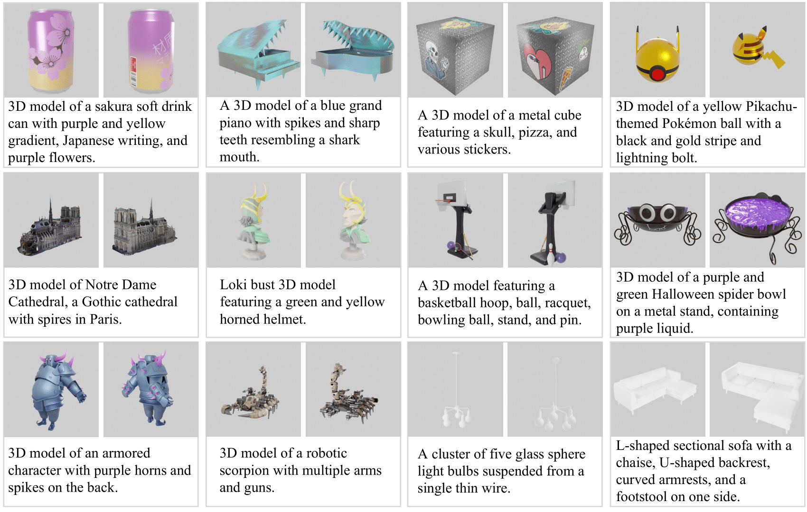

# [Scalable 3D Captioning with Pretrained Models](https://arxiv.org/abs//2306.07279)

<a href="https://cap3d-um.github.io/"></a> 
<a href="https://arxiv.org/abs/2306.07279"></a>
<a href="https://arxiv.org/abs/2404.07984"></a>

[Tiange Luo*](https://tiangeluo.github.io/), [Chris Rockwell*](https://crockwell.github.io), [Honglak Lee†](https://web.eecs.umich.edu/~honglak/), [Justin Johnson†](https://web.eecs.umich.edu/~justincj) (*Equal contribution    †Equal Advising)


Data download available at [Hugging Face](https://huggingface.co/datasets/tiange/Cap3D), including `1,002,422` descriptive captions for 3D objects in [Objaverse](https://objaverse.allenai.org/) and a subset of [Objaverse-XL](https://arxiv.org/abs/2307.05663), from our two works [Cap3D](https://arxiv.org/abs/2306.07279) and [DiffuRank](https://arxiv.org/abs/2404.07984). We also include `1,002,422` point clouds and rendered images (with camera, depth, and MatAlpha information), corresponding to the objects with captions. 3D-caption pairs for [ABO](https://amazon-berkeley-objects.s3.amazonaws.com/index.html) are listed [here](https://huggingface.co/datasets/tiange/Cap3D/tree/main/misc).

Our 3D captioning codes can be found in the [captioning_pipeline](https://github.com/crockwell/Cap3D/tree/main/captioning_pipeline) folder, while the [text-to-3D](https://github.com/crockwell/Cap3D/tree/main/text-to-3D) folder contains codes for evaluating and fine-tuning text-to-3D models. Some newer code (e.g., rendering) are included at [DiffuRank](https://github.com/tiangeluo/DiffuRank).

## Overview
Cap3D provides detailed descriptions of 3D objects by leveraging pretrained models in captioning, alignment, and LLM to consolidate multi-view information.




## Citation
If you find our code or data useful, please consider citing:
```
@article{luo2023scalable,
      title={Scalable 3D Captioning with Pretrained Models},
      author={Luo, Tiange and Rockwell, Chris and Lee, Honglak and Johnson, Justin},
      journal={arXiv preprint arXiv:2306.07279},
      year={2023}
}

@article{luo2024view,
      title={View Selection for 3D Captioning via Diffusion Ranking},
      author={Luo, Tiange and Johnson, Justin and Lee, Honglak},
      journal={arXiv preprint arXiv:2404.07984},
      year={2024}
}
```

If you use our captions for Objaverse objects, please cite:
```
@inproceedings{deitke2023objaverse,
  title={Objaverse: A universe of annotated 3d objects},
  author={Deitke, Matt and Schwenk, Dustin and Salvador, Jordi and Weihs, Luca and Michel, Oscar and VanderBilt, Eli and Schmidt, Ludwig and Ehsani, Kiana and Kembhavi, Aniruddha and Farhadi, Ali},
  booktitle={Proceedings of the IEEE/CVF Conference on Computer Vision and Pattern Recognition},
  pages={13142--13153},
  year={2023}
}
```

If you use our captions for ABO objects, please cite:
```
@inproceedings{collins2022abo,
  title={Abo: Dataset and benchmarks for real-world 3d object understanding},
  author={Collins, Jasmine and Goel, Shubham and Deng, Kenan and Luthra, Achleshwar and Xu, Leon and Gundogdu, Erhan and Zhang, Xi and Vicente, Tomas F Yago and Dideriksen, Thomas and Arora, Himanshu and others},
  booktitle={Proceedings of the IEEE/CVF Conference on Computer Vision and Pattern Recognition},
  pages={21126--21136},
  year={2022}
}
```

## Acknowledgments
This work is supported by two grants from LG AI Research and Grant #1453651 from NSF.
Thanks to <a href="https://www.linkedin.com/in/kaiyi-li-1b4a1114b/">Kaiyi Li</a> for his technical supports.
Thanks to <a href="https://mbanani.github.io/">Mohamed El Banani</a>, <a href="http://kdexd.xyz/">Karan Desai</a> and <a href="https://nileshkulkarni.github.io/">Ang Cao</a> for their many helpful suggestions. Thanks <a href="https://mattdeitke.com/">Matt Deitke</a> for helping with Objaverse-related questions. Thanks <a href="https://github.com/w-hc">Haochen</a> for helping fix the incorrect renderings.

We also thank the below open-source projects:
- [PyTorch](https://www.github.com/pytorch/pytorch) 
- [Blender](https://github.com/blender/blender)
- [PyTorch3D](https://github.com/facebookresearch/pytorch3d)
- [BLIP2](https://github.com/salesforce/LAVIS/tree/main/projects/blip2)
- [CLIP](https://github.com/openai/CLIP)
